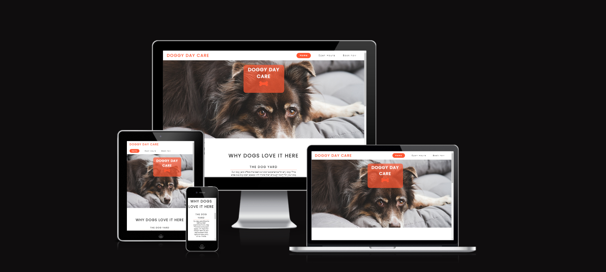
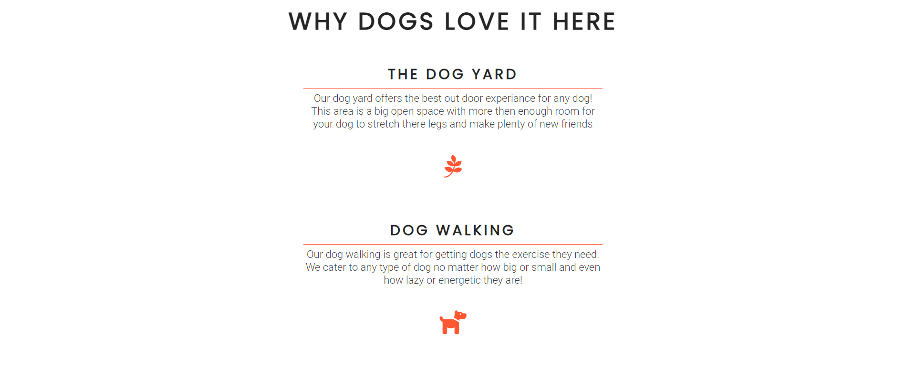
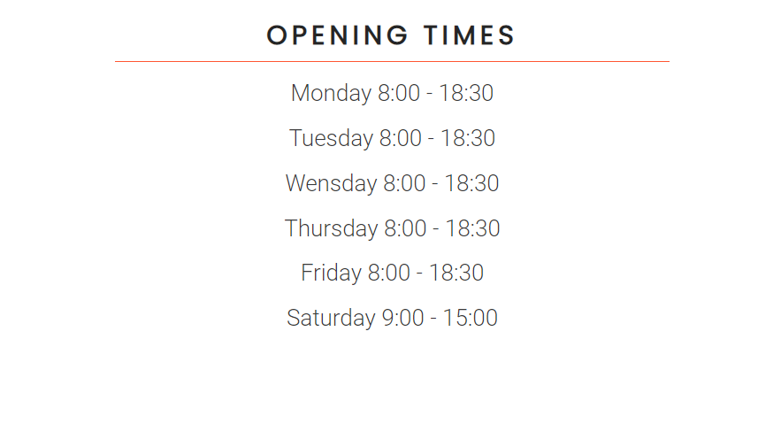
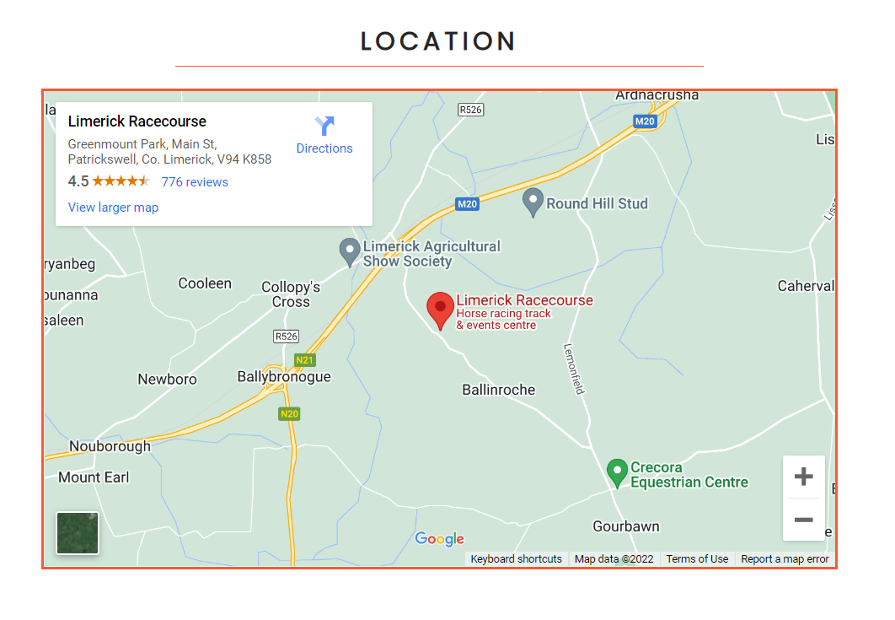
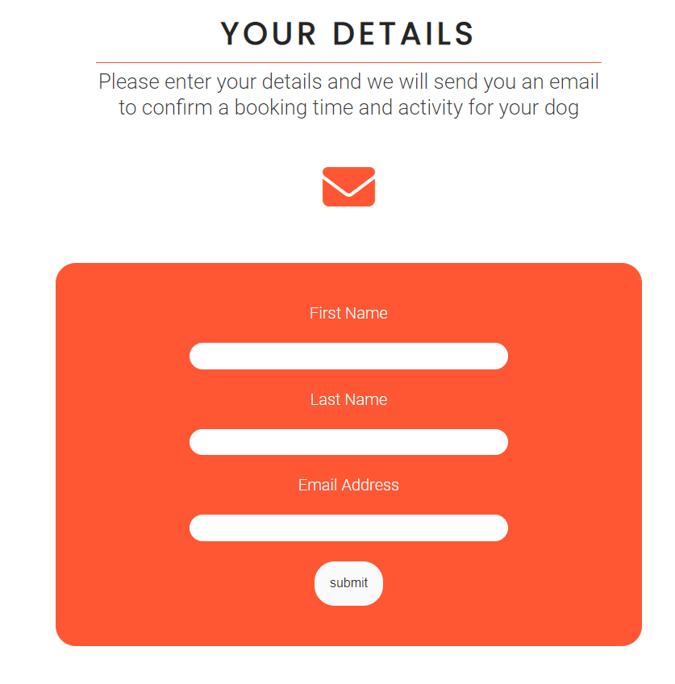
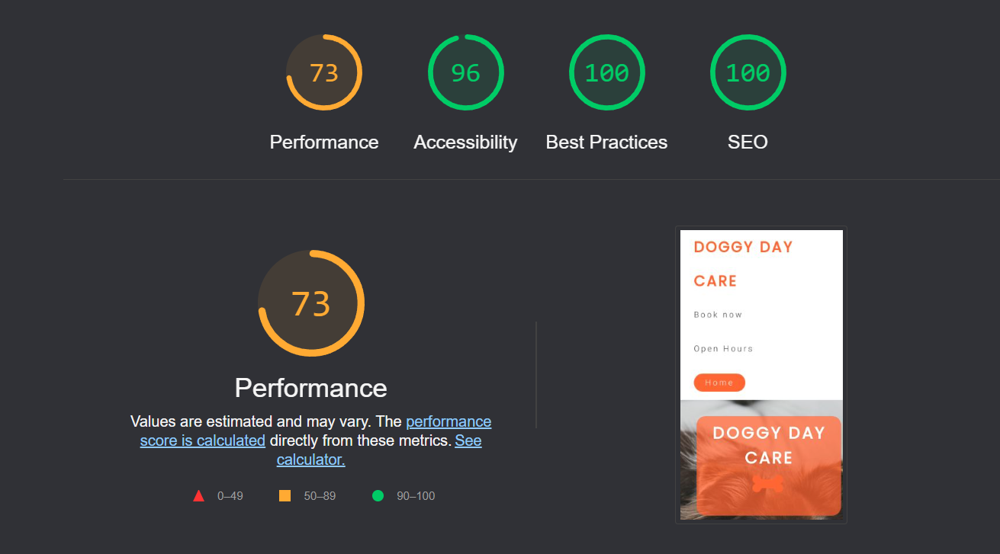

# Doggy Day Care

Doggy Day Care is a website for a a dog care business that provides many dog caring facilitys like walking, grooming, training and dog minding. This website is to help with easy bookings and provide all the information needed about Doggy Day Care. 

## Features 

### Existing Features

- __Navigation Bar__

  - Featured on all three pages, the full responsive navigation bar includes links to the Logo, Home page, Open-times and Bookings page and is identical in each page to allow for easy navigation.
  - This section will allow the user to easily navigate from page to page across all devices without having to revert back to the previous page via the ‘back’ button. 
  - When on your selected page the page name is highlighted to easily show user what page they are currently on.

- __The landing page image__

  - The landing includes a photograph with text overlay to allow the user to to read the Doggy Day Care logo. 
  - This section introduces the user to Doggy Day Care with an eye catching animation to grab their attention.

- __About Section__

  - The About section will allow the user to see the benefits of Doggy Day Care, as well as all the services we provide. 
 

 

- __The Footer__ 

  - The footer section includes links to the relevant social media sites for Doggy Day Care. The links will open to a new tab to allow easy navigation for the user. 
  - The footer section also includes contact info like email and phone number.
  - The footer is valuable to the user as it encourages them to keep connected via social media.

- __Open Hours__

  - The open hours page will provide the user with the opening times and the location using google maps for easy access and quick location display. 
  - This section is valuable to the user as it gives them the info they need for open times and location.

- __Map Location__
    - The map location was used to give the user an easy way to find where Doggy Day Care is located.
    - Using google maps lets the user get directions to Doggy Day Care easily.

- __Booking Page__

  - This page will allow the user to get Book an appointment in the Doggy Day Care. The user will be asked to submit their full name and email address to recieve and email with further details. 

### Features Left to Implement

- An email system to send the user an email to get a time and date booked in with Doggy Day Care.

## Testing 

### Validator Testing 

- HTML
  - No errors were returned when passing through the official [W3C validator](https://validator.w3.org/nu/?doc=https%3A%2F%2Fcode-institute-org.github.io%2Flove-running-2.0%2Findex.html)
- CSS
  - No errors were found when passing through the official [(Jigsaw) validator](https://jigsaw.w3.org/css-validator/validator?uri=https%3A%2F%2Fvalidator.w3.org%2Fnu%2F%3Fdoc%3Dhttps%253A%252F%252Fcode-institute-org.github.io%252Flove-running-2.0%252Findex.html&profile=css3svg&usermedium=all&warning=1&vextwarning=&lang=en#css)
- Lighthouse score
    - Score was given by official [webdev lighthouse](https://web.dev/measure/?gclid=CjwKCAjw-rOaBhA9EiwAUkLV4pZbeEVqP9vuP4NPNqvQs7TVgbh62-3Yyva7M_aGi5DsBzNf4GFicxoC6mYQAvD_BwE)

### Unfixed Bugs

Google map location can get cut out of the viewport below 770px, the map can still be used and viewed.

## Deployment

- The site was deployed to GitHub pages. 

The live link can be found here - https://barryk112.github.io/dog-day-care/

## Credits 

### Content 

- The icons used in the webpage were taken from [Font Awesome](https://fontawesome.com/)

### Media

- The photo used on the home page are from This Open Source site https://pixabay.com/
 